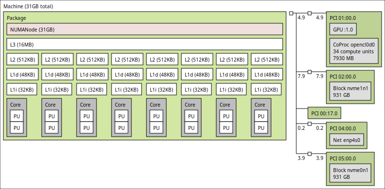

# Trabalho 1

## Estratégia de paralelização

## Experimentos e Metodologia

Algumas orientações foram feitas para a execução dos experimentos:

- todo teste deve ser executado pelo menos 20 vezes e os valores médios com desvio padrão devem ser considerados
- flags de compilação: `-O3 -fopenmp -march=native`
- Testar com frequencia fixa e variável
- Testar sempre na mesma máquina
- Fixar as threads nos nucleos físicos

### Máquina escolhida para testes

#### Hardware

O hardware e sistema operacional utilizados para os testes são os seguintes:

- CPU: 11th Gen Intel i7-11700K (16) @ 4.900GHz
- GPU: NVIDIA GeForce RTX 4060 Ti
- Memory: 32GB DDR4 3200MHz
- Disk: 1TB NVMe PCIE 4.0 SSD Write Speed: 4000MB/s Read Speed: 6000MB/s
- Motherboard: B560M DS3H V2
- Kernel: 6.11.0-19-generic
- OS: Ubuntu 24.04.2 LTS x86_64

A topologia da CPU é a seguinte:

### Experimentos

### Metodologia

## Desempenho

### Tempo em trechos sequenciais

### Speedup teórico usando a lei de Amdahl

Speedup teórico usando a lei de Amdahl para 2,4,8 e N processdores:

### Tabela de Speedup e eficiência reais

## Escalabilidade

## Análise de resultados
