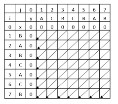
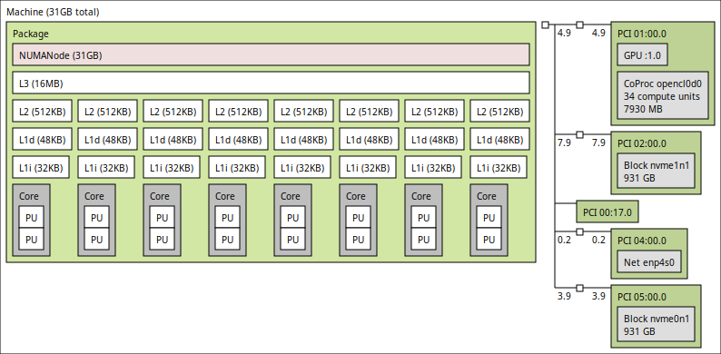

# Trabalho 1

Paralelizar o algoritmo de busca da maior subsequência comum entre dois vetores (LCS) usando OpenMP.

## Estratégia de paralelização

O algoritmo que encontra a maior subsequência comum (LCS) utilizando programação dinâmica é altamente dependente de dados, o que torna a paralelização mais desafiadora. Portanto, vamos alterara o método de ranking da matriz com o objetivo de reduzir a dependência entre os dados.

O novo método utilizado é o da antidiagonal, onde a matriz é preenchida em ordem de antidiagonais. Isso vai evitar o problema de dependência entre os dados, pois cada antidiagonal pode ser preenchida independentemente. Um exemplo visual do preenchimento é mostrado abaixo:



Visto que cada célula i,j da matriz depende apenas das células i-1,j-1, i-1,j e i,j-1, podemos dividir o trabalho entre as threads. Assim, cada thread preenche um elemento de uma diagonal da matriz.

Isso pode ser visto no seguinte trecho de código:

```c
int pLCS_antidiagonal(mtype **scoreMatrix, int sizeA, int sizeB, char *seqA, char *seqB) {
    int i, j, d;

    // starting at 2 to skip the first row and column
    // d is the diagonal index
    for (d = 2; d <= sizeA + sizeB; d++) {
        // i ranges from max(1, d - sizeA) to min(sizeB, d - 1)
        int row_start = d - sizeA;
        if (d - sizeA < 1) 
            row_start = 1;

        // j ranges from max(1, d - sizeB) to min(sizeA, d - 1)
        int row_end = d - 1;
        if (d - 1 > sizeB)
            row_end = sizeB;

        // Fill the diagonal
        #pragma omp parallel for private(i, j) shared(scoreMatrix, seqA, seqB)
        for (i = row_start; i <= row_end; i++) {
            // if the column is out of bounds, skip
            j = d - i;
            if (j > sizeA) continue;

            // match case
            if (seqA[j - 1] == seqB[i - 1]) {
                scoreMatrix[i][j] = scoreMatrix[i - 1][j - 1] + 1;
            // mismatch case
            } else {
                scoreMatrix[i][j] = max(scoreMatrix[i - 1][j], scoreMatrix[i][j - 1]);
            }
        }
    }

    return scoreMatrix[sizeB][sizeA];
}
```

É possível paralelizar o preenchimento de uma antidiagonal, mas, novamente, haverá o problema de dependência entre as threads. Para resolver isso a complexidade do código e também o overhead de operações entre threads aumentam. Portanto, o código não foi alterado para paralelizar o preenchimento de uma antidiagonal.

## Experimentos e Metodologia

Algumas orientações foram feitas para a execução dos experimentos:

- todo teste deve ser executado pelo menos 20 vezes e os valores médios com desvio padrão devem ser considerados
- flags de compilação: `-O3 -fopenmp -march=native`
- Testar com frequencia fixa e variável
- Testar sempre na mesma máquina
- Fixar as threads nos nucleos físicos

### Máquina escolhida para testes

O hardware e sistema operacional utilizados para os testes são os seguintes:

- CPU: 11th Gen Intel i7-11700K (16) @ 4.900GHz
- GPU: NVIDIA GeForce RTX 4060 Ti
- Memory: 32GB DDR4 3200MHz
- Disk: 1TB NVMe PCIE 4.0 SSD Write Speed: 4000MB/s Read Speed: 6000MB/s
- Motherboard: B560M DS3H V2
- Kernel: 6.11.0-19-generic
- OS: Ubuntu 24.04.2 LTS x86_64

A topologia da CPU é a seguinte:



### Metodologia

Os experimentos foram todos executados em uma mesma máquina, especificada abaixo.
O código foi compilado com as flags `-O3 -fopenmp -march=native`.
O número de threads foi fixado em 2, 4, 8 e 16.
Os testes foram realizados entre os tamanhos de 60.000 e 62.000 caracteres, com um incremento de 100 caracteres. Essa faixa foi escolhida para garantir um tempo mínimo de 10s e evitar o estouro de memória da máquina.

## Desempenho

### Tempo em trechos sequenciais

### Speedup teórico usando a lei de Amdahl

Speedup teórico usando a lei de Amdahl para 2,4,8 e N processdores:

### Tabela de Speedup e eficiência reais

## Escalabilidade

## Análise de resultados
